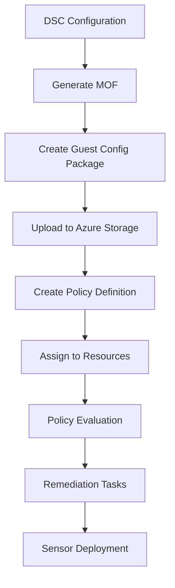

# CrowdStrike Falcon DSC Configuration for Azure

This repository contains a complete PowerShell DSC (Desired State Configuration) solution for deploying CrowdStrike Falcon sensors in Azure environments, specifically designed to work with Azure DSC Guest Configuration.

## 📁 Repository Structure

```
├── CrowdStrikeFalconDSC.ps1         # Main DSC configuration script
├── FalconDSCConfigData.psd1          # Configuration data for different environments
├── Deploy-FalconGuestConfig.ps1      # Azure DSC Guest Configuration deployment script
├── Test-FalconDSC.ps1                # Validation and testing functions
└── README.md                         # This file
```

## 🎯 Purpose

This DSC configuration was built based on deployment patterns from the **Cloud-Azure-main** repository and provides:

- **Azure DSC Guest Configuration** compliance for CrowdStrike Falcon sensor deployment
- **Multi-environment support** (Development, Staging, Production)
- **Secure credential management** using Azure Key Vault
- **Comprehensive validation** and testing capabilities
- **Azure Policy integration** for enterprise-scale deployment

## 🚀 Quick Start

### Prerequisites

1. **PowerShell 5.1+** with DSC modules
2. **Azure PowerShell modules**:
   ```powershell
   Install-Module Az.Accounts, Az.Profile, Az.GuestConfiguration, Az.KeyVault, Az.Resources -Force
   ```
3. **Azure subscription** with appropriate permissions
4. **CrowdStrike Falcon API credentials**

### Basic Usage

1. **Store credentials in Azure Key Vault**:
   ```powershell
   # Create secrets in Key Vault
   Set-AzKeyVaultSecret -VaultName "your-keyvault" -Name "falcon-client-id" -SecretValue (ConvertTo-SecureString "your-client-id" -AsPlainText -Force)
   Set-AzKeyVaultSecret -VaultName "your-keyvault" -Name "falcon-client-secret" -SecretValue (ConvertTo-SecureString "your-client-secret" -AsPlainText -Force)
   ```

2. **Deploy to Azure DSC Guest Configuration**:
   ```powershell
   .\Deploy-FalconGuestConfig.ps1 -SubscriptionId "your-subscription-id" -ResourceGroupName "rg-falcon-dsc" -KeyVaultName "your-keyvault" -FalconCloud "us-1"
   ```

3. **Validate configuration before deployment**:
   ```powershell
   .\Test-FalconDSC.ps1
   Test-FalconDSCConfiguration -ConfigurationPath ".\CrowdStrikeFalconDSC.ps1" -FalconClientId "test" -FalconClientSecret "test"
   ```

## 📋 Detailed Documentation

### CrowdStrikeFalconDSC.ps1

The main DSC configuration script that:

- Downloads the official CrowdStrike installation script from GitHub
- Installs the Falcon sensor with specified parameters
- Supports both standard and golden image (NO_START) installations
- Includes comprehensive error handling and logging
- Validates installation success

**Key Parameters**:
- `FalconClientId` - CrowdStrike API Client ID
- `FalconClientSecret` - CrowdStrike API Client Secret
- `FalconCloud` - Cloud region (us-1, us-2, eu-1, us-gov-1)
- `InstallParams` - Installation parameters (e.g., "/install /quiet /norestart")
- `SensorTags` - Sensor grouping tags for organization

**Usage Example**:
```powershell
# Load configuration
. .\CrowdStrikeFalconDSC.ps1

# Generate MOF for deployment
CrowdStrikeFalconDSC -FalconClientId "your-id" -FalconClientSecret "your-secret" -FalconCloud "us-1" -OutputPath ".\Output"
```

### FalconDSCConfigData.psd1

Configuration data file providing environment-specific settings:

**Environments Supported**:
- **Development**: NO_START mode for golden images, development tags
- **Staging**: Standard installation with staging tags
- **Production**: Full installation with production tags
- **AVD**: Azure Virtual Desktop session hosts
- **DevBox**: Microsoft Dev Box instances
- **ML Compute**: Azure Machine Learning compute instances

**Usage Example**:
```powershell
# Use configuration data
CrowdStrikeFalconDSC -ConfigurationData .\FalconDSCConfigData.psd1 -FalconClientId $id -FalconClientSecret $secret
```

### Deploy-FalconGuestConfig.ps1

Comprehensive deployment script for Azure DSC Guest Configuration:

**Features**:
- Creates Azure resources (Resource Group, Storage Account)
- Retrieves credentials securely from Azure Key Vault
- Packages DSC configuration for Guest Configuration
- Creates and assigns Azure Policy
- Includes validation and error handling

**Parameters**:
- `SubscriptionId` - Azure subscription ID
- `ResourceGroupName` - Resource group for artifacts
- `KeyVaultName` - Key Vault with CrowdStrike credentials
- `FalconCloud` - CrowdStrike cloud region
- `Environment` - Target environment (Development/Staging/Production)
- `AssignmentScope` - Policy assignment scope

**Usage Example**:
```powershell
# Deploy to production environment
.\Deploy-FalconGuestConfig.ps1 `
    -SubscriptionId "12345678-1234-1234-1234-123456789012" `
    -ResourceGroupName "rg-falcon-guestconfig" `
    -KeyVaultName "kv-falcon-credentials" `
    -FalconCloud "us-1" `
    -Environment "Production" `
    -AssignmentScope "/subscriptions/12345678-1234-1234-1234-123456789012/resourceGroups/rg-servers"
```

### Test-FalconDSC.ps1

Validation and testing module with three main functions:

#### Test-FalconDSCConfiguration
Validates DSC configuration before deployment:
- Configuration syntax validation
- Parameter validation
- Network connectivity testing
- Credential format validation

#### Test-FalconSensorInstallation
Verifies Falcon sensor installation:
- Service status checking
- Registry validation
- File system verification
- Process validation

#### Test-AzureGuestConfigCompliance
Tests Azure Guest Configuration compliance:
- Policy assignment validation
- Compliance state checking
- Remediation status monitoring

**Usage Examples**:
```powershell
# Test configuration before deployment
Test-FalconDSCConfiguration -ConfigurationPath ".\CrowdStrikeFalconDSC.ps1" -FalconClientId "test-id" -FalconClientSecret "test-secret"

# Verify sensor installation
Test-FalconSensorInstallation -ComputerName "SERVER01"

# Check Azure policy compliance
Test-AzureGuestConfigCompliance -SubscriptionId "your-sub-id" -PolicyName "CrowdStrike-Falcon-Sensor"
```

## 🏗️ Architecture

### Based on Cloud-Azure-main Patterns

This DSC configuration follows the same deployment patterns found in the Cloud-Azure-main repository:

1. **Official Script Download**: Uses CrowdStrike's official installation scripts from GitHub
2. **Secure Credential Handling**: Supports Azure Key Vault integration like the ML Compute method
3. **Environment-Specific Configuration**: Similar to Image Builder's parameter approach
4. **Comprehensive Logging**: Follows the logging patterns from existing methods

### DSC Guest Configuration Flow



## 🔧 Configuration Options

### Installation Parameters

| Parameter | Description | Example Values |
|-----------|-------------|----------------|
| `/install` | Installation mode | Always include |
| `/quiet` | Silent installation | Recommended |
| `/norestart` | Prevent automatic restart | Recommended |
| `NO_START=1` | Golden image mode | For base images |

### Sensor Tags

Organize sensors using tags:
- **Environment**: Development, Staging, Production
- **Role**: WebServer, Database, SessionHost, DevBox
- **Criticality**: Critical, Standard, NonProd

### Cloud Regions

| Region | Description |
|--------|-------------|
| `us-1` | US Commercial 1 |
| `us-2` | US Commercial 2 |
| `eu-1` | Europe |
| `us-gov-1` | US Government |

## 🔐 Security Considerations

### Credential Management

1. **Azure Key Vault**: Store API credentials as secrets
2. **Managed Identities**: Use for Azure resource authentication
3. **Certificate Encryption**: Encrypt DSC configuration MOF files
4. **Least Privilege**: Assign minimal required permissions

### Network Requirements

Ensure connectivity to CrowdStrike endpoints:
- `ts01-{cloud}.crowdstrike.com:443`
- `lfodown01-{cloud}.crowdstrike.com:443`

## 📊 Monitoring and Compliance

### Azure Policy Integration

- **Compliance Reporting**: View in Azure Policy portal
- **Remediation Tasks**: Automatic deployment to non-compliant resources
- **Audit Logging**: Track deployment status and issues

### CrowdStrike Console

Monitor deployed sensors in the CrowdStrike Falcon console:
- Verify sensor registration
- Check communication status
- Review applied tags and grouping

## 🚨 Troubleshooting

### Common Issues

1. **Credential Errors**:
   - Verify Key Vault access permissions
   - Check secret names match exactly
   - Validate API credential format

2. **Network Connectivity**:
   - Test firewall rules for CrowdStrike endpoints
   - Verify DNS resolution
   - Check proxy configurations

3. **Guest Configuration Issues**:
   - Ensure Guest Configuration provider is registered
   - Verify storage account permissions
   - Check policy assignment scope

### Debug Steps

1. **Run Validation**:
   ```powershell
   Test-FalconDSCConfiguration -ConfigurationPath ".\CrowdStrikeFalconDSC.ps1" -FalconClientId "test" -FalconClientSecret "test"
   ```

2. **Test Locally**:
   ```powershell
   # Generate and apply configuration locally
   CrowdStrikeFalconDSC -FalconClientId $id -FalconClientSecret $secret -OutputPath ".\Test"
   Start-DscConfiguration -Path ".\Test" -Wait -Verbose
   ```

3. **Check Logs**:
   - DSC: `C:\Windows\Temp\FalconDSC\`
   - Guest Configuration: Windows Event Logs
   - CrowdStrike: `C:\ProgramData\CrowdStrike\`

## 📚 Additional Resources

### Related Documentation

- [CrowdStrike Falcon API Documentation](https://falcon.crowdstrike.com/documentation)
- [Azure DSC Guest Configuration](https://docs.microsoft.com/en-us/azure/governance/policy/concepts/guest-configuration)
- [PowerShell DSC Documentation](https://docs.microsoft.com/en-us/powershell/scripting/dsc/)

### CrowdStrike Installation Scripts

This configuration uses official CrowdStrike scripts:
- **Windows**: `https://raw.githubusercontent.com/CrowdStrike/falcon-scripts/main/powershell/install/falcon_windows_install.ps1`
- **Linux**: `https://raw.githubusercontent.com/CrowdStrike/falcon-scripts/main/bash/install/falcon-linux-install.sh`

### Cloud-Azure-main Repository

Original deployment methods that inspired this DSC configuration:
- **VM Extensions**: Recommended for most scenarios
- **Image Builder**: Pre-installed sensor approach
- **Intune**: Centralized Windows management
- **ML Compute**: Custom scripting with Key Vault

## 🤝 Contributing

This configuration was generated based on patterns from the Cloud-Azure-main repository. For improvements or issues:

1. Test changes thoroughly in development environment
2. Validate with `Test-FalconDSCConfiguration` function
3. Document any new features or parameters
4. Follow PowerShell DSC best practices

## 📄 License

This configuration is provided as-is for educational and deployment purposes. Ensure compliance with your organization's security and deployment policies.

---

**Generated with Claude Code** based on CrowdStrike Cloud-Azure-main deployment patterns.